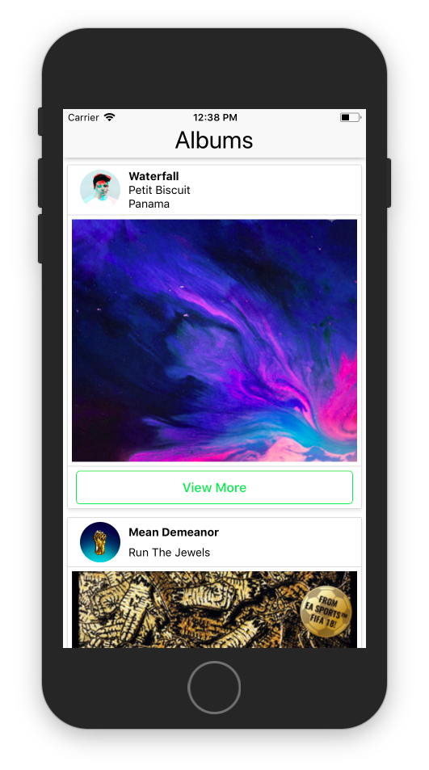

# Albums
A simple React Native app

Hey there,

This repo contains a simple application which shows newly released albums. It uses Spotify Web Api to fetch the data.
On tapping the button the user is taken to the album page. It is developed using React-Native. 
It can run on both ios and android devices.

## ScreenShot

<p align="center">

</p>

## To get started

1. Make sure you have your access token from Spotify
2. Download or clone this repo
3. Make sure you have node, react-native cli tools installed on your machine
4. cd to your project folder
5. Run this command to install all the dependencies 
```npm install```
6. Run this command to startup the app
```react-native run-ios``` or ```react-native run-android```

**Note**: The above mentioned guide has been tried and tested on mac. However, the same guide should also work on windows machines.

## Queries

email me at pranavj1001@gmail.com

## License

MIT License
